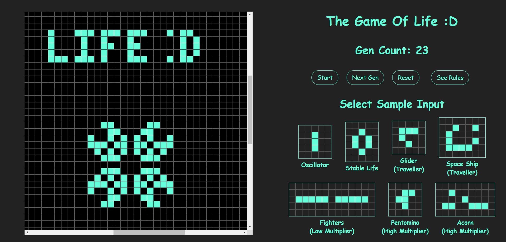
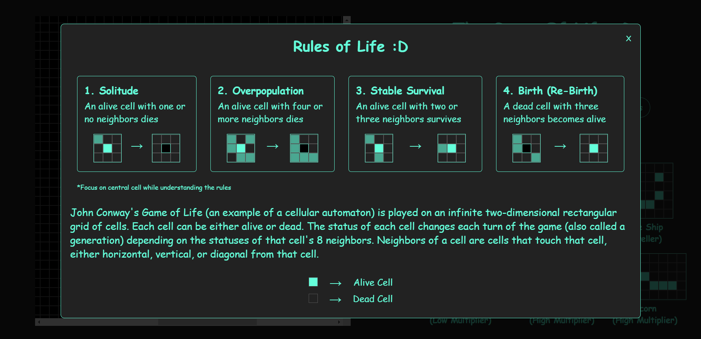

# life
John Conway's Game of Life (an example of a cellular automaton) is played on an infinite two-dimensional rectangular grid of cells. Each cell can be either alive or dead. The status of each cell changes each turn of the game (also called a generation) depending on the statuses of that cell's 8 neighbors. Neighbors of a cell are cells that touch that cell, either horizontal, vertical, or diagonal from that cell.

The website is a simple trial of the game.

## Live Demo - http://www.hrushikesh.tk/websites/life

## Screenshots - 

